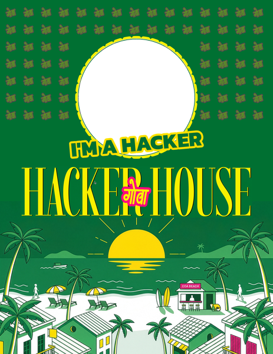

# Hacker House Goa — Builder Card

Generate your official **Hacker House Goa 2026** builder card from a photo. Crop it, download a PNG, or share to X with a pre-filled caption.

<p align="center">
  
</p>

Design file: [Figma — HHGoa IdCard](https://www.figma.com/design/3Qe6v9TrgcTaVcCiEwRnaq/HHGoa-IdCard?node-id=0-1)

## Features

- Upload **JPG / PNG / WEBP / HEIC**
- Circular crop with **zoom + drag to pan**
- Instant client-side composite (no upload server)
- **Download** a full-res PNG (1855×2400)
- **Share to X** — downloads the card and opens a pre-filled tweet
- **Bulk team** mode — many photos → ZIP of cards

## Setup

```bash
npm install
npm run dev
```

Open [http://localhost:3000](http://localhost:3000).

```bash
npm run build && npm start   # production
```

## How to use

### Single card

1. Enter an optional **team name** (used in the downloaded filename).
2. **Upload photo** — phone camera shots and HEIC from iPhone are fine.
3. In **Crop & frame**, drag inside the circle to pan and use **Zoom** to crop tighter.
4. Hit **Download** for a PNG, or **Share to X**:
   - The card PNG downloads automatically
   - A tweet opens with caption + `#FrameInGoa #HHGoa2026`
   - Attach the downloaded image before posting (X intent can’t attach files)

### Bulk team

1. Switch to **Bulk team**.
2. Optionally set a **team name** (ZIP / file names use it).
3. Upload many photos at once.
4. Wait for the ZIP — each photo becomes a centered-crop card, plus a `manifest.txt`.

## Project layout

| Path | Role |
|------|------|
| [`app/`](app/) | Next.js App Router page, layout, styles |
| [`components/IdCardStudio.tsx`](components/IdCardStudio.tsx) | Upload, crop, preview, download, share, bulk |
| [`lib/idcard.ts`](lib/idcard.ts) | Canvas compose + tweet caption |
| [`lib/heic.ts`](lib/heic.ts) | HEIC → JPEG |
| [`public/idcard/template.png`](public/idcard/template.png) | Fixed Figma card layout (transparent photo hole) |

## Stack

- Next.js 16 + React 19 + Tailwind CSS 4
- Canvas compositing in the browser
- `heic2any` for iPhone HEIC
- `jszip` for bulk export

## License

Private — Hacker House Goa / CtrlCrew.
